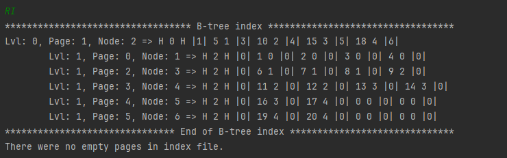
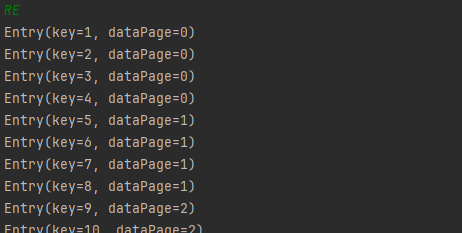
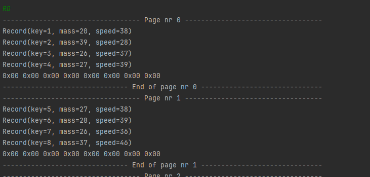
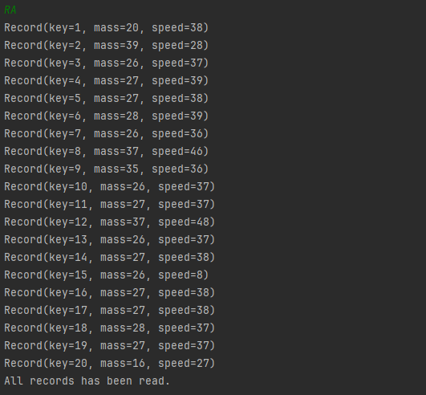

# B-Tree index implementation

## Table of contents

1. [Description](#description)
2. [Who may find it useful](#who-may-find-it-useful)
3. [How B-Tree and data is presented](#how-b---tree-and-data-is-presented)
4. [How to run](#how-to-run)
5. [Input commands and parameters](#input-commands)
6. [Index and data files structure](#index-and-data-file-structure)
7. [Memory management](#memory-management)

## Description

Second project of Database Structures subject - B-Tree index file to control data file.

This is a Java CLI application that runs a database-like structure - B-Tree index with associated data file. The data file stores simple records consisting of an 8-byte key and 2 integer values (each 4-bytes long). The index file contains B-Tree structure, which stores entries consisting of an aforementioned data record key and a page number in the data file, on which the record is written.

**Briefly on how B-Tree indexing works**

The index file controls the data file. All CRUD operations on the data file must go through the B-Tree, so it would contain information about locations of the records in the large data file and store these entries sorted. Index file helps in reducing IO operations on the big file, which, without it, would have to be read sequentially to find the desired record that we want to read. B-Tree ensures low number of disk reads to find an entry (with record key and its page number) thanks to its broad structure, consisting of nodes with multiple child-nodes pointers, and a requirement to visit only max. 'h' number of nodes to find an entry, where 'h' is the tree height.

## Who may find it useful

It is an educational project that aims to show how B-Tree indexing works and how it optimizes IO operations and memory management. It can be useful to students that are just starting to learn about that structure - it can help you visualize and experiment with it, which can ease a way through and make the learning process more enjoyable :) You can also study the implementation details if you want, to clarify some ideas on how to implement the structure yourselves.

## How B-Tree and data is presented

**B-Tree index**

Here is an example of how B-Tree structure is printed by the app:

Each node takes up 1 line in the window. In this line is printed all the information needed about the node:
- lvl - node's level in the tree. Level '0' is root and it increments down the tree. As it can be seen, levels are also marked by an indentation, for better readability of the B-Tree structure.
- page - page number in the index file, on which the node is stored. Page number is location in the file, which can be calculated by page_number * page_size. Page_size depends on one of the input parameters and will be explained later.
- node - node's number, which is just page_number + 1. It is shifted by one just to reserve '0' as a special value for node pointer, that means null pointer.
- => - after the arrow, the contents of the node are described:
    - H 2 H - between two letters 'H' there is a header of the node. Header contains pointer on the parent node. In this example, number 2 is the parent node number of one of the nodes.
	- sequence of entries, e.g. |1| 5 1 |3| - one number between two '|' symbols is a child node pointer. Two numbers between child pointers create an entry - first is a key of some record stored in data file, and the second is a page, on which that record lies in the data file. About child pointers, if a pointer is on the left of an entry, that means it points to a child node, which contains only entries with smaller keys than this entry key. The same goes for the right child pointer, only it points to a child node containg only entries with bigger keys.
	
We can also print just the entries if we want:

	
**Data file records**

Now let's see how records from the data file are printed. We can:
1. Explore data alignment of the data file and print raw byte data,
2. Or just see all the records printed in order of their keys.
	
Contents of the data file printed raw, as its data is aligned at the disk:

Records printed in order of their keys:

