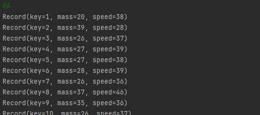
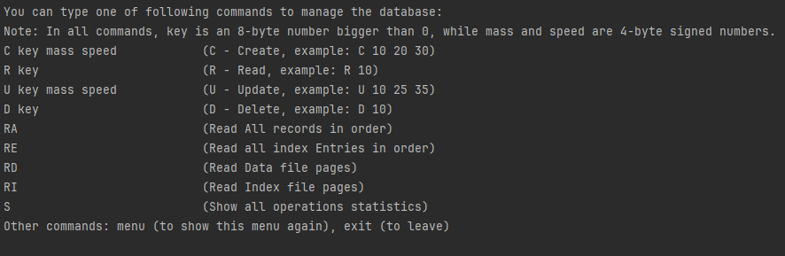

# B-Tree index implementation

## Table of contents

1. [Description](#description)
2. [Who may find it useful](#who-may-find-it-useful)
3. [How B-Tree and data is presented](#how-b-tree-and-data-is-presented)
4. [How to run](#how-to-run)
5. [Input commands and parameters](#input-commands-and-parameters)
6. [Index and data files structure](#index-and-data-files-structure)
7. [Memory management](#memory-management)


## Description

Second project of Database Structures subject - B-Tree index file to control data file.

This is a Java CLI application that runs a database-like structure - B-Tree index with associated data file. The data file stores simple records consisting of an 8-byte key and 2 integer values, representing a mass and speed of some object (each 4-bytes long). The index file contains B-Tree structure, which stores entries consisting of an aforementioned data record key and a page number in the data file, on which the record is written.

**Briefly on how B-Tree indexing works**

The index file controls the data file. All CRUD operations on the data file must go through the B-Tree, so it would contain information about locations of the records in the large data file and store these entries sorted. Index file helps in reducing IO operations on the big file, which, without it, would have to be read sequentially to find the desired record that we want to read. B-Tree ensures low number of disk reads to find an entry (with record key and its page number) thanks to its broad structure, consisting of nodes with multiple child-nodes pointers, and a requirement to visit only max. 'h' number of nodes to find an entry, where 'h' is the tree height.

## Who may find it useful

It is an educational project that aims to show how B-Tree indexing works and how it optimizes IO operations and memory management. It can be useful to students that are just starting to learn about that structure - it can help you visualize and experiment with it, which can ease a way through and make the learning process more enjoyable :) You can also study the implementation details if you want, to clarify some ideas on how to implement the structure yourselves.

## How B-Tree and data is presented

**B-Tree index**

Here is an example of how B-Tree structure is printed by the app:


Each node takes up 1 line in the window. In this line is printed all the information needed about the node:
- `Lvl` - node's level in the tree. Level '0' is root and it increments down the tree. As it can be seen, levels are also marked by an indentation, for better readability of the B-Tree structure.
- `Page` - page number in the index file, on which the node is stored. Page number is location in the file, which can be calculated by page_number * page_size. Page_size depends on one of the input parameters and will be explained later [here](#input-commands-and-parameters).
- `Node` - node's number, which is just page_number + 1. It is shifted by one just to reserve '0' as a special value for node pointer, that means null pointer.
- `=>` - after the arrow, the contents of the node are described:
    - `H 2 H` - between two letters 'H' there is a header of the node. Header contains pointer on the parent node. In this example, number 2 is the parent node number of one of the nodes.
	- sequence of entries, e.g. `|1| 5 1 |3|` - one number between two '|' symbols is a child node pointer. Two numbers between child pointers create an entry - first is a key of some record stored in data file, and the second is a page, on which that record lies in the data file. About child pointers, if a pointer is on the left of an entry, that means it points to a child node, which contains only entries with smaller keys than this entry key. The same goes for the right child pointer, only it points to a child node containg only entries with bigger keys.
	
We can also print just the entries if we want:


	
**Data file records**

Now let's see how records from the data file are printed. We can:
1. Explore data alignment of the data file and print raw byte data,
2. Or just see all the records printed in order of their keys.
	
Contents of the data file printed raw, as its data is aligned at the disk:


Records printed in order of their keys:



**IO operations statistics**

At last, you can also see the reads and writes statistics after executing some commands on the database structure. You can also analyze B-Tree special operations counts, like `merge`, `split`, and `compensate` (summed up underflow and overflow compensations):


## How to run

The project is a standard Java project with only Lombok dependency added. You can run it in IntellijIdea and make use of existing `.idea` configurations or run it in your favourite IDE (although some additional startup configuration might be needed). To run in IntellijIdea, just open the `BTreeIndex` directory and press Shift + F10.

You can also run the latest release of the app that can be accessed [here](./../../releases), which is in a form of a `.jar` file. You can run it on any operating system, that has a JRE installed, with a command:

```
java -jar BTreeIndex.jar
```

## Input commands and parameters

Input commands are quite straightforward and are also described in the app menu itself:



You can also generate or write a file containing a sequence of input commands, for faster testing :) The file should be a `.txt` file and look like e.g.:

```
C 1 20 38
C 27 10 29
U 1 30 30
D 27
```

Here are the options in menu to choose writing input in command line or providing self-written or generated random commands input file:


As for parameters, user can input:


The parameter descriptions:
- `Path for database files` - it's just a location in which the index and data file will be stored and managed. You can stay with the `./tapes/` option.
- `Data file buffers number` - the index and data file are read in blocks, so only 'n' number of pages is loaded in memory at a time. Buffer equals one page. You can change the setting if you want to see how it will affect disk reads and writes statistics. This setting is for data file buffers number.
- `Index file buffers number` - same as previous, just for index file buffers number.
- `B-tree degree` - it is the most important parameter. The degree is the minimum number of entries that a node has to contain (except for root) to not be merged with some other underflown node. Maximum number of entries is degree * 2. This parameter dictates the size of the node - it also affects the page_size, as it is assumed in this app, that one node takes up exactly one disk page. You can calculate node size (and page size) with the formula: header_size + n * entry_size + (n+1) * child_pointer_size, where n = degree * 2 (sizes: header_size - 4 bytes, entry_size - 12 bytes, child_pointer_size - 4 bytes).

## Index and data files structure

Both index and data files are stored as binary files with `.dat` extension. You can't read them as text, because they're not written as strings, but just as a binary numbers representing the node and records data, node by node, record by record. However, you can decode them in the app, with `RI` and `RD` commands.

The files memory layout on disk is organized page by page - and the page size, as mentioned before, is dependent on and equal to a single B-Tree node size. Records are written as a whole and must fit in one page, there is no dividing records between 2 pages - that means that there might be some empty bytes at the end of each data file page. This mechanism was selected to avoid unnecesary additional page reads and writes, when creating or deleting a record, and for the statistics of these operations to be easier to analyze too.

Another thing worth mentioning is what happens to the files layout, when records are deleted.

1. When a record is deleted, the page in data file containing it is loaded into memory. The space for the record is emptied and the records that were after it are being shifted to the left to overwrite it - thanks to that, free space on this page is always only at the end of it, after its last record. 
2. What happens in the index file is similar, the entries are rewritten so that only at the end of the node there are empty places for new ones. Here might also happen some special operations from B-Tree as `merge` or `compensate` - first deletes one of the underflown nodes (node containing less than degree number of entries) and merges it with another, which leaves one empty page in the index file. The second one only rewrites some entries between 2 nodes, so each of them contains at least a minimum number of entries.

**Author's note:** In project, the files are reffered to as tapes, but in reality that name doesn't matter here - I had other project for the class, where it was important that the files had been read sequentially and we had to think about them as to be similar to reading a tape. Here they're random access though, so the name doesn't work now :P

## Memory management

The files are loaded to memory with use of buffers - we assume a database would be a large file and it might even not fit in the RAM memory. So it is read with only few pages loaded at a time, to ensure constant space complexity (constant memory usage), regardless of the database file size. User can choose how much buffers can be read at a time from both of the files and how big the page is.

The buffers freeing mechanism is simple - if a page we want to retrieve isn't already loaded and a buffer is full, one page, that is the furthest in the file from the one we try to load, is released.